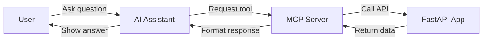
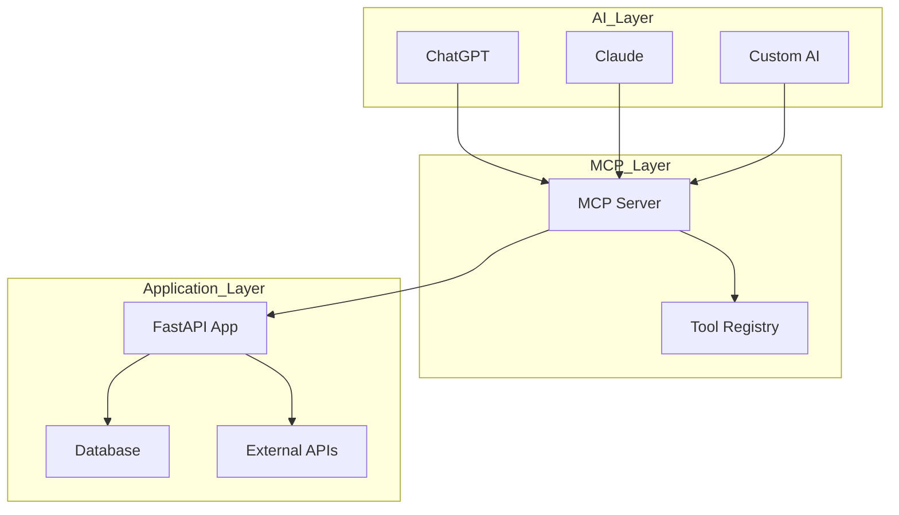
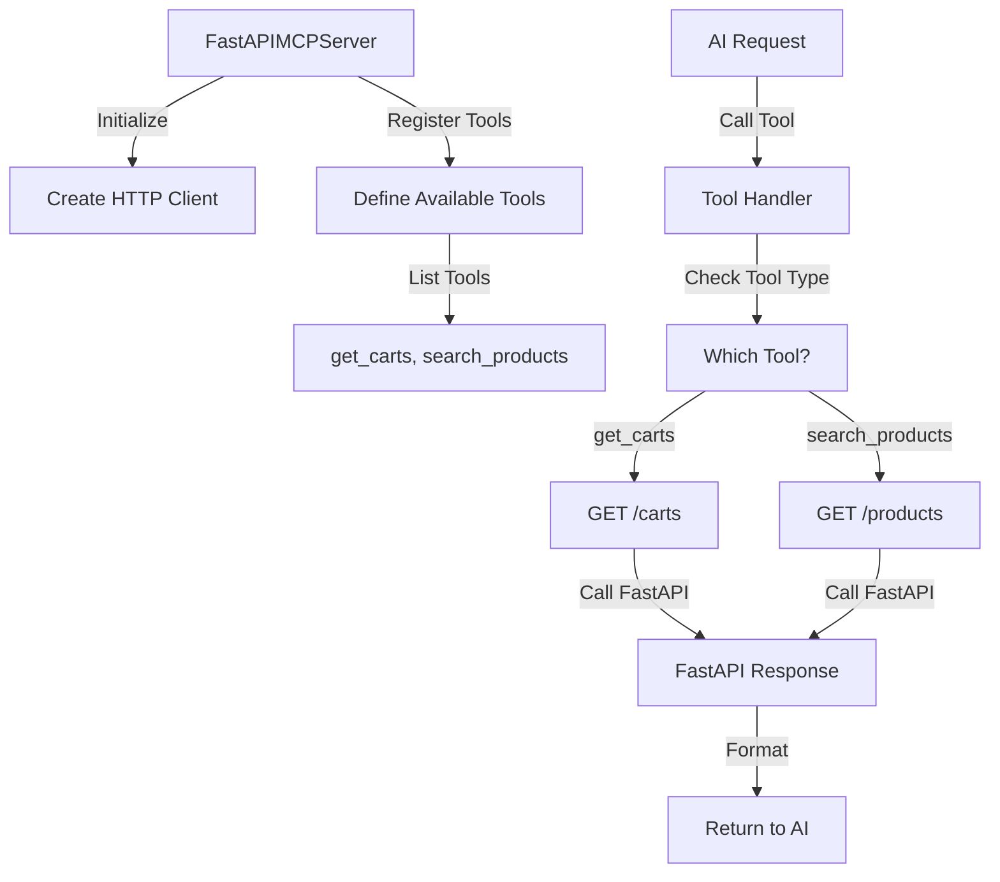

# FastAPI MCP Demo

A simple demonstration of how to connect AI assistants to your FastAPI applications using the Model Context Protocol (MCP).

## What is MCP?

**Model Context Protocol (MCP)** is like a universal translator that lets AI assistants talk to your applications and services. Think of it as a bridge that allows AI tools (like ChatGPT, Claude, or other AI assistants) to safely access and control your software systems.

## How This Demo Works

This demo shows how to create an MCP server that connects AI assistants to a FastAPI web application. Here's the flow:

1. **FastAPI App** (`main.py`) - Your web application with endpoints
2. **MCP Server** (`mcp_server.py`) - The bridge that translates AI requests into API calls
3. **AI Assistant** - Any MCP-compatible AI tool that can use your services

### 🔄 System Flow Diagram



### 🏗️ Real-World Architecture



## Project Structure

### 📁 Files Explained

- **`main.py`** - A simple FastAPI web application with two endpoints:
  - `/carts` - Returns a list of shopping carts for a user
  - `/products` - Returns a list of products

- **`mcp_server.py`** - The MCP server that:
  - Connects to your FastAPI app
  - Exposes your API endpoints as "tools" that AI can use
  - Handles communication between AI assistants and your app

- **`demo_client.py`** - A simple script to test if the MCP server starts correctly

- **`test_tools.py`** - Tests the FastAPI endpoints directly to make sure they work

## Real-World Use Cases

### 🏪 E-commerce Assistant
Imagine an AI assistant that can:
- Search your product catalog
- Check inventory levels
- Process orders
- Show user shopping carts
- Answer customer questions about products


## How to Use This Demo

### 1. Start the FastAPI Server
```bash
uvicorn main:app --reload
```

### 2. Start the MCP Server
```bash
python mcp_server.py
```

### 3. Connect an AI Assistant
Any MCP-compatible AI tool can now:
- Show user shopping carts
- Search for products in your catalog

## The Magic Behind the Scenes

### FastAPIMCPServer Class
This is the main class that:
- **Creates the bridge** between AI and your FastAPI app
- **Registers tools** that AI can use (like `get_carts` and `search_products`)
- **Translates requests** from AI into HTTP calls to your API
- **Returns results** back to the AI in a format it understands

### 🔧 Internal Class Flow



### Key Methods:
- `_register_tools()` - Defines what actions AI can perform
- `call_tool()` - Executes the actual API calls when AI requests something
- `run()` - Starts the MCP server and keeps it running


## Steps to demo

1. **Install dependencies:**
   ```bash
   pip install -r requirements.txt
   ```

2. **Start your FastAPI server:**
   ```bash
   uvicorn main:app --reload
   ```

3. **Test the endpoints:**
   ```bash
   python test_tools.py
   ```

4. **Start the MCP server:**
   ```bash
   python mcp_server.py
   ```

5. **Connect an AI assistant** that supports MCP and start asking questions!

This demo shows the foundation feasibility!