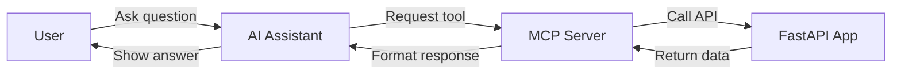
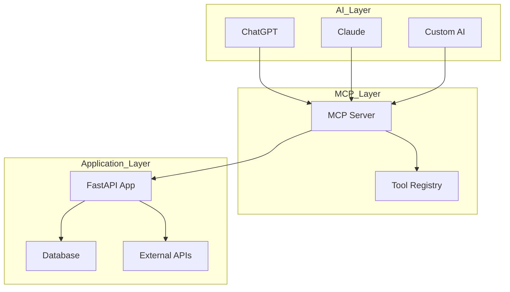
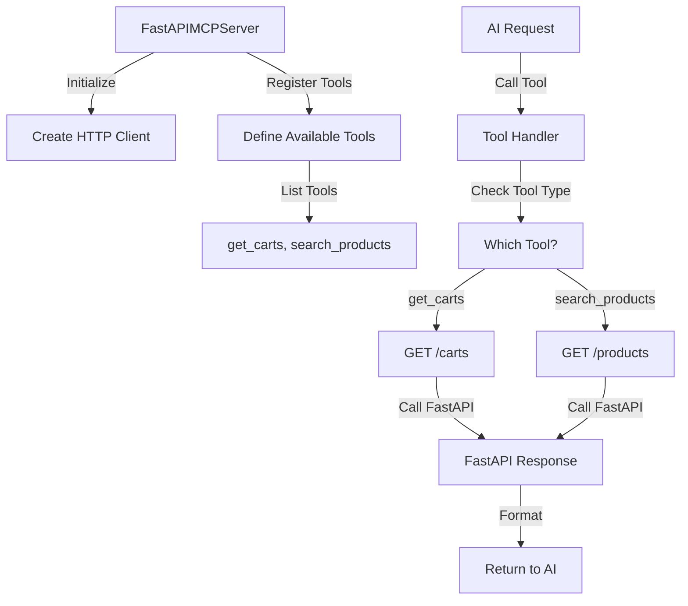

# FastAPI MCP Demo

A simple demonstration of how to connect AI assistants to your FastAPI applications using the Model Context Protocol (MCP).

## What is MCP?

**Model Context Protocol (MCP)** is like a universal translator that lets AI assistants talk to your applications and services. Think of it as a bridge that allows AI tools (like ChatGPT, Claude, or other AI assistants) to safely access and control your software systems.

## How This Demo Works

This demo shows how to create an MCP server that connects AI assistants to a FastAPI web application. Here's the flow:

1. **FastAPI App** (`main.py`) - Your web application with endpoints
2. **MCP Server** (`mcp_server.py`) - The bridge that translates AI requests into API calls
3. **AI Assistant** - Any MCP-compatible AI tool that can use your services

### 🔄 System Flow Diagram

### 🏗️ Real-World Architecture

## Real-World Use Cases

### 🏪 E-commerce Assistant
Imagine an AI assistant that can:
- 🔍 Search product catalog
- 🛒 View customer carts
- 📦 Track inventory

### Connect an AI Assistant
Any MCP-compatible AI tool can now:
- Show user shopping carts
- Search for products in your catalog

### 🔧 Internal Class Flow

5. **Connect an AI assistant** that supports MCP and start asking questions!

This demo shows the foundation feasibility!